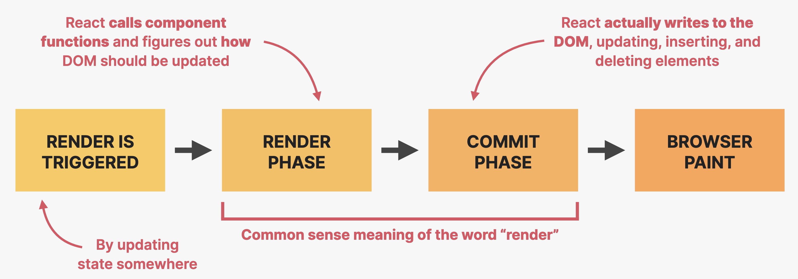

# 02-Intermediate_React

## 1. Components, Composition, and Reusability

### 1.1 Component Catagories

* 绝大部分组件可以被划分为三类：
  1. Stateless / presentational components => 小，可复用
  2. Stateful components => 可复用
  3. Structural components => 构成结构的组件，不可复用

### 1.2 Prop Drilling

* 需要将 Props 传递很深时，非常麻烦 => 采用 Component Composition

```javascript
export default function App() {
  const [movies, setMovies] = useState(tempMovieData);
  const [watched, setWatched] = useState(tempWatchedData);

  return (
    <>
      <NavBar>
        <Logo />
        <Search />
        <NumResult movies={movies} />
      </NavBar>

      <Main>
        <Box>
          <MovieList movies={movies} />
        </Box>
        
        <Box>
          <WatchedSummary watched={watched} />
          <WatchedList watched={watched} />
        </Box>
      </Main>
    </>
  );
}
```

### 1.3 Component Composition

* 组件组合 => 更优雅的组件组合方式
  * 可以轻松改变组件内部需要展示的子组件 => 使用 `{children}` 来传递组件
  * 应用场景：
    1. 创建高度可复用和灵活的组件
    2. 解决 **Prop Drilling** 的问题

```javascript
function modal() {
  return (
  	<div className="modal">
    	<Success />
    </div>
  )
}

function success() {
  return <p>Well done!</p>
}
```

```javascript
<Modal>
  <Success />
</Modal>

function modal({children}) {
  return (
    <div>
    	{children}
    </div>
  )
}

function Success() {
  return <p>Well done!</p>
}
```

### 1.4 Props as a Component API


### 1.5 Prop Types

```javascript
import PropTypes from "prop-types";
StarRating.propTypes = {
  maxRating: PropTypes.number,
  defaultRating: PropTypes.number,
  color: PropTypes.string,
  size: PropTypes.number,
  message: PropTypes.array,
  className: PropTypes.string,
  onSetRating: PropTypes.func,
};
```


## 2. How React Works

### 2.1 Components, Instances, and Elements

* **Components**: Description of a piece of UI, 只是一个函数 => 蓝图 / 框架
  * 返回: React elements (JSX) 
* **Instances**: Are created when "**use**" components
  * 组件的“物理”实现，有自己的 Lifecycle
  * 经常和 Component 进行混用
* **Elements**: result of these function calls 实例的返回结果
  * 组件在浏览器中真正的视觉呈现


### 2.2 How Rendering Works



* 两种情况下触发渲染

  1. 应用的初始渲染
  2. 一个或多个组件实例中的状态发生变化 (re-render)

  * 渲染过程针对整个应用程序触发，而非单个组件
  * 渲染并不是在状态更新后立即触发的，而是被安排在 JS 引擎有空闲的时候

* 通常意义上的 **Render** 指的是 <u>Render Phase + Commit Phase</u>

#### I. Render Phase 


* **Render Phase**
  * 调用组件函数，弄清楚稍后需要在 DOM 中修改什么
  * 只在 React 内部发生，<u>不会产生任何视觉变化</u> => Commit Phase 干的事情

* **Virtual DOM**：由组件树 (Component Tree) 中的所有实例创建的 **React Element Tree**
  * Cheap and fast，但只是一个简单的对象而已


* **Reconciliation**
  * 决定哪些 DOM 元素真的需要被插入、删除或更新，以反映最新的状态更改
  * 使用原因：
    1. 写入 DOM 相对较慢
    2. 通常情况下只有一小部分的 DOM 需要被更新 => React 会复用尽可能多的已有 DOM


* **Fiber Tree**
  * 一个特殊的内部树，对于应用程序中的每个组件实例和 DOM 元素，都有一个 **Fiber**
    * Fiber 不会在每次渲染时重新创建
  * Fiber Tree 永远不会被摧毁，也不会从头开始重新构建
    * 他是一个可变数据结构，会在未来步骤中一次又一次发生变化
    * 因此当前状态 (Current State)、Props、Side Effects、Used Hooks 都会被保存在 Fiber Tree 中
  * 采用链表结构来连接 Fiber


#### II. Commit Phase

* 通过更新 DOM 来提醒浏览器向屏幕更新 UI

* React 实际上并没有动过 DOM，而是通过 `ReactDOM` 或其它渲染器 (Renderer) 来进行操作

  * React 本身并不知道渲染阶段的结果实际上会在哪里提交和绘制

    i.e. **React 的责任到 Render Phase 产生更新列表 (Update List) 就结束了**


 ### 2.3 How Diffing Works

* **两个根本规则**
  1. 两个不同类型的元素会产生不同的 tree
     * React 会认定整个子树都是不可用的
     * 旧组件会被摧毁并移出 DOM，包括其中的状态
  2. 两次渲染之间，树中相同位置有完全相同的元素
     * 元素（及其子元素）会被保留，包括其中的状态
     * Props / Attributes 如果改变，会在渲染间被传递
     * 这种标准行为不满足需求、需要创建具有新状态的新组件实例时，需要指定 **key prop**

* **Key Prop**
  * 用于告诉 diffing algorithm 某个元素是独一无二的，让 React 能够区分同一组件的多个实例 
  * 作用：
    1. 当 key 在渲染中保持不变时，元素会在 DOM 中被保留（即使它在树中的位置发生变化）
    2. 当 key 在渲染中发生改变时，元素会被摧毁，新的元素会被创建（即使它在树中的位置保持不变）
  * **All in All**: 当位于需要根据变化重置状态的位置时，只需要给元素分配一个 Key


### 2.4 Logic in React Components

* 两类逻辑

  1. **Render Logic**
     * 位于组件函数顶层的代码
     * 参与描述特定组件实例的视图应该是什么样子
     * 每次组件进行渲染时都会被执行

  1. **Event Handler Functions**
     * Executed as a **consequence of the event** that the handler is listening for
     * 作为干活的代码：更新状态、执行 HTTP 请求、读取输入区域、导航至另一页

#### I. Pure Components

* **Pure Function**

  * 没有 **Side Effect** 的函数
  * 不会改变任何超出其作用域的变量

  ```javascript
  // pure function
  function circleArea(r) {
    return 3.14 * r * r;
  }
  ```

* **Side Effect**

  * Dependency on or modification of any data outside the function scope

    i.e. 与外界有互动的函数 => 操作外界变量、HTTP requests

    ```javascript
    const area = {}
    function circleArea(r) {
      // 改变了函数外界的数据，有 side effect
      areas.circle = 3.14 * r * r;
    }
    ```

    ```javascript
    function circleArea(r) {
      // date 会一直改变，不可预测，有 side effect
      const date = Date.now();
      const area = 3.14 * r * r;
      return `${date}: ${area}`;
    }
    ```

  * **Side effect 并不是坏东西！**但为了制作 bug-free 的应用程序，我们需要知道**何时、如何创建** side effect

#### II. General Rule

* **Components must be pure when it comes to render logic**
  * 如果我们给某个组件实例相同的 props (input)，则该组件应该总是返回完全相同的 JSX (output)
  * 顶层运行并负责呈现组件的逻辑，须与外部世界没有交互
    * 不能有网络请求
    * 不能开启计时器
    * 不能直接调用 DOM API
    * 不能操作函数作用域之外的 Objects 或 Variables => 因此不能改变 props
    * 不能在渲染逻辑中更新状态或饮用 => 会产生无限循环
  * Side effect 在 **事件处理函数 **中被允许 (鼓励)；可以使用 `useEffect` 来注册该 side effect


### 2.5 How State Updates Are Batched


* React 18 之后，在事件处理函数之外、对于 Promise / Timeout 也会进行 Batching


### 2.6 How Events Work


## 3. Effects and Data Fetching

### 3.1 Component Lifecycle 

* 12
  1. Mount / Initial render
  2. Re-render
  3. Unmount
* 可以定义在特定时间点执行的代码 => `useEffect`

### 3.2 Wrong Way

```javascript
export default function App() {
  const [movies, setMovies] = useState(tempMovieData);
  const [watched, setWatched] = useState(tempWatchedData);

  fetch(`http://www.omdbapi.com/?apikey=${KEY}&s=interstellar`)
    .then((res) => res.json())
    .then((data) => setMovies(data.Search));

  return (...);
```

* 会导致不停地提交网络请求 => 每次 state 更新都会重新渲染，然后通过 setMovies 更新，因此进入死循环

### 3.3 `useEffect` Hook

* `useEffect` 钩子注册的副作用只会在特定的渲染之后执行
  * e.g. 只会在初次渲染中执行

```javascript
useEffect(function () {
  fetch(`http://www.omdbapi.com/?apikey=${KEY}&s=interstellar`)
    .then((res) => res.json())
    .then((data) => setMovies(data.Search));
}, []);
```

* 第二个参数是 dependency list，当是空数组的时候，只会在 mount / unmount 的时候调用

### 3.4 Use Async Function

* 错误用法：`useEffect` 中的函数是同步的，不能异步

```javascript
useEffect(async function () {
  fetch(`http://www.omdbapi.com/?apikey=${KEY}&s=interstellar`)
    .then((res) => res.json())
    .then((data) => setMovies(data.Search));
}, []);
```

* 正确用法

```javascript
useEffect(function () {
  async function fetchMovies() {
    const res = await fetch(
      `http://www.omdbapi.com/?apikey=${KEY}&s=${query}`
    );
    const data = await res.json();
    setMovies(data.Search);
    console.log(data.Search);
  }
  fetchMovies();
}, []);
```

### 3.5 `useEffect` Dependency Array

* 通过给依赖数组来防止 effect 在每次渲染之后运行
  * 每次依赖数组中的依赖项发生改变时，effect 会被执行
  * effect 中被用到的每一个 **state variable** 和 **prop** 都必须被包含在依赖数组中
    * 否则会导致 **stale closure**
* 同步机制
  * `useEffect` 类似于一个监听依赖项变化的 event listener
  * `useEffect` hook 实际上是关于同步和组件生命周期的


### 3.6 `useEffect` Cleanup Function

* Function that we can **return from an effect**
  * 两种情况下触发
    1. 在 effect 将要执行前
    2. 在组件 unmounted 之后

```javascript
useEffect(
  function () {
    title && (document.title = `Movie | ${title}`);

    return function () {
      document.title = "usePopcorn";
      };
  },
  [title]
);
```

* Clean Up Data Fetching
  * 使用中止控制器 (`AbortController`) 防止过多的 data fetching

### 3.7 Listening to a Keypress

* 错误写法：每次 `useEffect` 运行的时候都会添加一个新的 event listener，会导致 Listener 的数量不停累积，占用内存、产生问题

```javascript
useEffect(
  function () {
    document.addEventListener("keydown", function (e) {
      if (e.code === "Escape") {
        onCloseMovie();
        console.log("CLOSING");
      }
    });
  },
  [onCloseMovie]
);
```

* 正确写法：调用 cleanup function 在组件被 unmount 之后把 Event Listener 清理掉

```javascript
useEffect(
  function () {
    function callback(e) {
      if (e.code === "Escape") {
        onCloseMovie();
          console.log("CLOSING");
      }
    }

    // Add event listener.
    document.addEventListener("keydown", callback);
    // Clean up event listener.
    return function () {
      document.removeEventListener("keydown", callback);
    };
  },
  [onCloseMovie]
);
```

## 4. Custom Hooks, Refs and More State

* **React Hooks**
  * Special built-in functions that allow us to **"hook" into React internals**
  * Always start with **"use"**
  * 使得复用非视觉逻辑变得容易

* 常用钩子
  * 最常用：`useState` `useEffect` `useReducer` `useContext`
  * 少用：`useRef` `uesCallback` `useMemo` `useTransition` `useDeferredValue`

* Rules
  1. 只能在顶层调用
  2. 只能在 React Functions 中调用
  3.  
