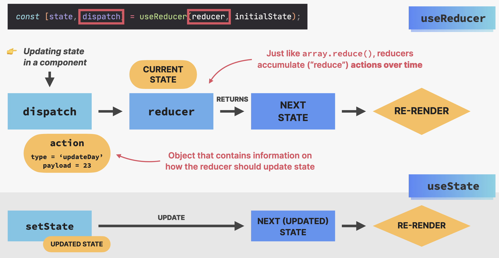
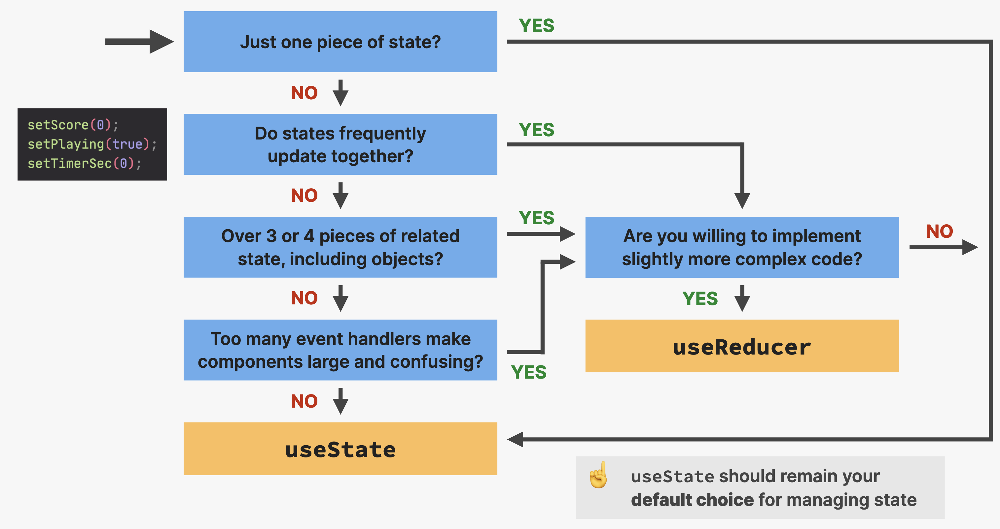
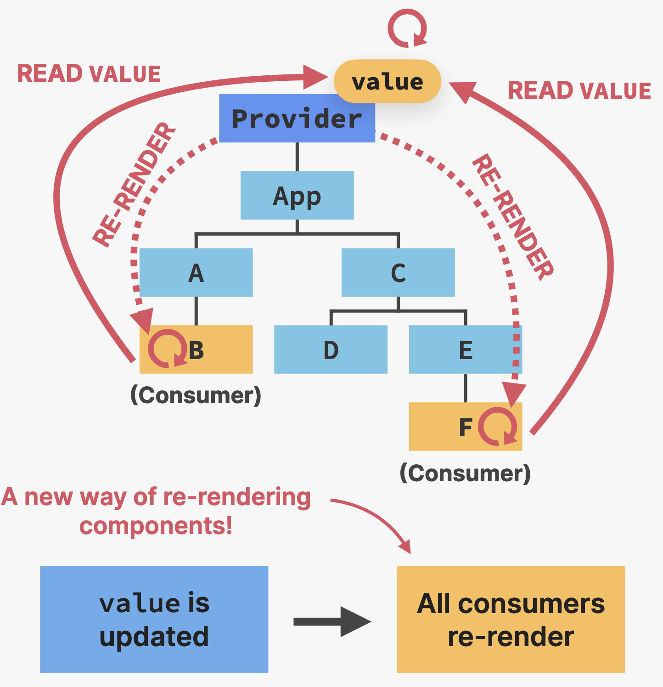
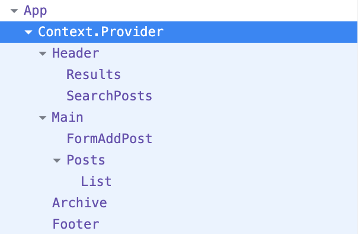
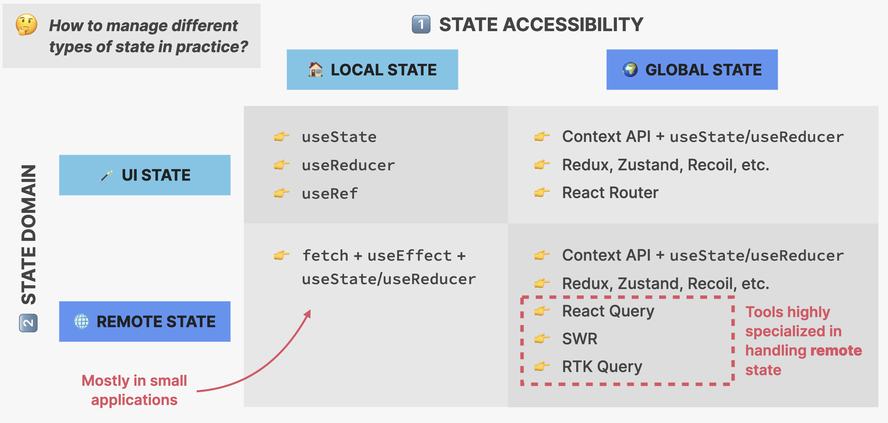
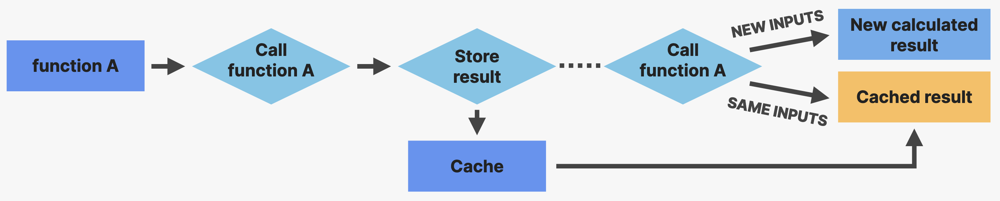

# 03-Advanced React + Redux

## 1. `useReducer` Hook

 ```javascript
 function reducer(state, action) {
   switch (action.type) {
     case "dec":
       return { ...state, count: state.count - state.step };
     case "inc":
       return { ...state, count: state.count + state.step };
     case "setCount":
       return { ...state, count: state.payload };
     case "setStep":
       return { ...state, step: action.payload };
     case "reset":
       return initialState;
     default:
       throw new Error("Unkown action");
   }
 }
 
 function DateCounter() {
   const [count, dispatch] = useReducer(reducer, 0);
   const dec = function () {
   	dispatch({ type: "dec", payload: 1 });
   };
   ...
 }
 ```

* Why `useReducer`? => 使用 `useState` 进行状态管理，在某些情况下不够
  1. 当组件有一堆状态和状态更新，分布在整个组件的多个 event handler 中时
  2. 当多个状态更新需要在同时进行更新时
  3. 当更新一个状态需要依赖一个或多个其它状态时

```javascript
const [count, dispatch] = useReducer(reducer, 0);
```

* State with `useReducer`
  * 状态被存储在一个 state object 中
  * `useReducer` 需要一个 `reducer` 函数，包含所有更新状态逻辑，**将状态逻辑和组件本身 (event handler) 完全解耦** => `setState()` with superpowers
  * `reducer` 是一个纯函数，会接受当前状态和一个动作，根据这些值返回更新之后的状态
    * `state` 同样是不可变的，`reducer` 中也不允许有 side effect
  * `action` 是一个 object，描述怎样进行状态更新
  * `dispatch` 事用于触发状态更新的函数，从 event handlers 发送 action 给 reducer



* 使用 `json-server` 创建伪 API

  ```bash
  npm i json-server
  ```

  ```json
  	...
  	"scripts": {
      ...
      "server": "json-server --watch data/questions.json --port 8000"
    },
  	...
  ```

  ```bash
  npm run server
  ```

* 何时使用 `useReducer`



## 2. React Router

* 使用 vite 创建 react 应用，并使用 ESLint

```bash
npm create vite@latest
# 需要 ESLint
npm i eslint vite-plugin-eslint eslint-config-react-app --save-dev
```

```json
// 创建 .eslintrc.json 文件保存 ESLint 配置
{
  "extends": "react-app"
}
```

```javascript
// 修改 vite.config.js 文件
import { defineConfig } from "vite";
import react from "@vitejs/plugin-react";
import eslint from "vite-plugin-eslint";

export default defineConfig({
  plugins: [react(), eslintPlugin({ failOnError: false })],
});
```

### 2.1 Routing

* **SPA**: Single-Page Application 单页应用 => 完全在客户端 (浏览器) 中执行的应用
  * **Routes**: 不同的 URL 匹配不同的 views (components)
  * **JavaScript**: (React) 用来更新页面 (DOM)
  * 整个页面永不刷新，如同一个本机应用
* `react-router`

```bash
npm i react-router-dom
```

```jsx
import { BrowserRouter, Routes, Route } from "react-router-dom";
import Product from "./pages/Product";
import Pricing from "./pages/Pricing";
import Homepage from "./pages/Homepage";

function App() {
  return (
    <BrowserRouter
      future={{ v7_startTransition: true, v7_relativeSplatPath: true }}
    >
      <Routes>
        <Route path="/" element={<Homepage />} />
        <Route path="product" element={<Product />} />
        <Route path="pricing" element={<Pricing />} />
      </Routes>
    </BrowserRouter>
  );
}

export default App;
```

* Routing

```jsx
// 直接使用会导致页面刷新和网络请求 => 不好
<a href="/pricing">Pricing</a>
// 采用由 React-Router 提供的 "Link" / "NavLink"
// 采用"NavLink"会在源码中添加一个"active"类 方便在CSS中修改
<NavLink to="/">Home</NavLink> 
```

### 2.2 Styling

* **CSS Modules**: 大型项目中不会使用全局 CSS 文件，其作用域应是一个单独的组件

```jsx
// 全局引用 => 在 main 文件中
import "./index.css"
// 局部引用 => 在每个单独的页面中
import styles from "./PageNave.module.css"
<nav className={styles.nav}>...</nav>
```

```css
/* 在局部文件中添加全局 css 类 */
.nav :global(.active) {
  background-color: green;
}
```

### 2.3 Nested Routes

e.g. `localhost:xxxx/app/cities`

```jsx
<Route path="app" element={<Applayout />}>
  { /* Index Route 默认展示 */ }
  <Route index element={<p>List of Cities</p>} />
	<Route path="cities" element={<p>List of Cities</p>} />
	<Route path="countries" element={<p>Countries</p>} />
	<Route path="form" element={<p>Form</p>} />
</Route>
```

```jsx
function Sidebar() {
  return (
    <div className={styles.sidebar}>
      ...
      { /* 类似于 {children} */}
      <Outlet />
      ...
  );
}
```

### 2.4 Storing State in the URL

* 使用原因
  1. Easy way to store state in a **global place**, accessible to **all components** in the app
  2. Good way to **"pass" data** from one page into the next page
  3. Makes it possible to **bookmark and share** the page with the exact UI state it had at the time
* 

```jsx
// App.jsx 中 => `:id` 决定了稍后 City.jsx 中-
// fetch data 得到的 object 中对应值的 key 名
<Route path="cities/:id" element={<City />} />

// City.jsx 中 使用 `useParams` 来获取数据
function City() {
  const x = useParams();
  ...
};

// CityItem.jsx 中
function CityItem({ city }) {
  // 获取 id
  const { id } = city;
  // 获取 query params
  const [searchParams, setSearchParams] = useSearchParams();
  const lat = searchParams.get("lat");
  const lng = searchParams.get("lng");
  
  return (
    <li >
      <Link className={styles.cityItem} to={`${id}`}>
        ...
      </Link>
    </li>
  );
}
```

### 2.5 `useNavigate`

```jsx
const navigate = useNavigate()
// 前往页面
<div className={...} onClick={() => {navigate("form")}}>
  ...
</div>
// 返回页面 -1 代表向后返回一次
<Button type="back" onClick={(e) => {
  // 在 form 中的时候要防止提交表单刷新页面
	e.preventDefault();
	navigate(-1);
}}
>
	&larr; Back
</Button>
```

* `<Navigate />` 的使用: 类似于重定向
  * 需要添加 `replace` 关键字，来替换 index 页面在栈中的位置，不然无法返回
    * 这是目前 `<Navigate />` 几乎唯一的用法

```jsx
<Route
  index
  element={<Navigate replace to="cities" />}
/>
<Route
	path="cities"
	element={<CityList cities={cities} isLoading={isLoading} />}
/>
```

* `replace`

```jsx
navigate("/app", { replace: true });
```

## 3. Context API

* 目的：防止 "Prop Drilling"，允许我们 "broadcast" 全局状态
  1. **Provide**: 为子组件提供访问 "value" 的权限
  2. **Value**: 通常是状态和函数
  3. **Consumer**: 每一个需要读取 Provider Context Value 的组件



### 3.1 使用：

```jsx
// 1) Create new context.
const PostContext = createContext();
```

```jsx
return (
  // 2) Provide value to child components
  <PostContext.Provider
    value={{
      posts: SearchPosts,
      onAddPost: handleAddPost,
      onClearPosts: handleClearPosts,
      searchQuery,
      setSearchQuery,
    }}
  >  
    ...
  </PostContext.Provider>
```

```jsx
// 3) Consuming the context value
const { onClearPosts } = useContext(PostContext);
```



### 3.2 更优雅的方式

更优雅的创建 Context API 方式：全部提出来放在新文件中

```jsx
import { createContext, useState } from "react";
import { faker } from "@faker-js/faker";

// 1) Create new context.
const PostContext = createContext();

// 2) Create new context provider.
function PostProvider({ children }) {
  return (
    <PostContext.Provider
      value={{
        ...
      }}
    >
      {children}
    </PostContext.Provider>
  );
}

// 3) Encapsulate `useContext` into a new custom hook.
function usePosts() {
  const context = useContext(PostContext);
  return context;
}

export { PostProvider, usePosts };
```

* 使用的时候

```jsx
import { PostProvider, PostContext } from "./PostContext";
```



### 3.3 *实现地图

* 安装 `leaflet` => 最大的开源地图库

```bash
# 需要是 react@19 才能够安装 react-leaflet@5
# react@18 => react-leaflet@4
npm i react-leaflet leaflet
```

```jsx
function Map() {
  const [mapPosition, setMapPosition] = useState([40, 0]);
  
  return (
    <div>
      <MapContainer
        className={styles.map}
        center={mapPosition}
        zoom={13}
        scrollWheelZoom={true}
      >
        <TileLayer
          attribution='&copy; <a href="https://www.openstreetmap.org/copyright">OpenStreetMap</a> contributors'
          url="https://{s}.tile.openstreetmap.fr/hot/{z}/{x}/{y}.png"
        />
        <Marker position={mapPosition}>
          <Popup>
            A pretty CSS3 popup. <br /> Easily customizable.
          </Popup>
        </Marker>
      </MapContainer>
    </div>
  );
}
```

* 钩子组件：返回 `null`

```jsx
/* `useMap` Hook */
function ChangeCenter({ position }) {
  const map = useMap();
  map.setView(position);
}

/* `useMapEvents` Hook */
function DetectClick() {
  const navigate = useNavigate();
  useMapEvents({
    click: (e) => {
      navigate(`form?lat=${e.latlng.lat}&lng=${e.latlng.lng}`);
    },
  });
}

/* 写到 JSX 组件中 */
function Map() {
  const [mapPosition, setMapPosition] = useState([40, 0]);
  
  return (
    <div>
      <MapContainer ...>
        ...
        { /* 改变地图展示的中心 */ }
        <ChangeCenter position={mapPosition} />
        { /* 检测地图中的点击 */ }
        <DetectClick />
      </MapContainer>
    </div>
  );
}
```

* 创建城市 (标准的 `post` 请求)

```jsx
// Context API 中
async function createCity(newCity) {
  try {
    setIsLoading(true);
    const res = await fetch(`${BASE_URL}/cities/`, {
      method: "POST",
      body: JSON.stringify(newCity),
      headers: {
        "Content-Type": "application/json",
      },
    });
    const data = await res.json();
    setCities((prevCities) => [...prevCities, data]);
  } catch (err) {
    alert("There was an error loading data...");
  } finally {
    setIsLoading(false);
  }
}
```

* 使用 `useReducer` 重构 `Context API`

  * `function::reducer`

  ```jsx
  // 本应用中 context 需要处理的是异步数据
  // `reducer` 需要是纯函数，不能够包含异步逻辑
  // 因此不能把所有的逻辑都放在 `reducer` 中
  function reducer(state, action) {
    switch (action.type) {
      case "loading":
        return {
          ...state,
          isLoading: true,
        };
  
      case "cities/loaded":
        return {
          ...state,
          isLoading: false,
          cities: action.payload,
        };
  
      ...
  
      case "rejected":
        return {
          ...state,
          isLoading: false,
          error: action.payload,
        };
  
      default:
        throw new Error("Unkonw action type.");
    }
  }
  ```

  * `function::CityProvider(...)`

  ```jsx
  function CitiesProvider({ children }) {
    const [{ cities, isLoading, currentCity }, dispatch] = useReducer(
      reducer,
      initialState
    );
  
    useEffect(function () {
      async function fetchCities() {
        dispatch({ type: "loading" });
  
        try {
          const res = await fetch(`${BASE_URL}/cities`);
          const data = await res.json();
          dispatch({
            type: "cities/loaded",
            payload: data,
          });
        } catch (err) {
          dispatch({
            type: "rejected",
            payload: "There was an error loading data...",
          });
        }
      }
  
      fetchCities();
    }, []);
    
    ...
  
    return (
      <CitiesContext.Provider value={{...}}>
        {children}
      </CitiesContext.Provider>
    );
  }
  ```

### 3.5 Fake Authentication


## 4. Performance Optimization 

* **Performance Optimization Tools**
  1. Prevent wasted renders
  2. Improve app speed (Responsiveness)
  3. Reduce bundle size

* `profiler`

### 4.1 使用 `children` 优化

现有 `SlowComponent`

```jsx
function SlowComponent() {
  const words = Array.from({ length: 100_000 }, () => "WORD");
  return (
    <ul>
      {words.map((word, i) => (
        <li key={i}>
          {i}: {word}
        </li>
      ))}
    </ul>
  );
}
```

* 原先做法 => 更新状态非常慢，因为要重新渲染 `SlowComponent`

  ```jsx
  export default function Test() {
    const [count, setCount] = useState(0);
    return (
      <div>
        <h1>Slow counter?!?</h1>
        <button onClick={() => setCount((c) => c + 1)}>Increase: {count}</button>
        <SlowComponent />
      </div>
    );
  }
  ```

* 使用 `children` => 不会重新渲染 `SlowComponent`

  ```jsx
  function Counter({ children }) {
    const [count, setCount] = useState(0);
    return (
      <div>
        <h1>Slow counter?!?</h1>
        <button onClick={() => setCount((c) => c + 1)}>Increase: {count}</button>
        {children}
      </div>
    );
  }
  
  export default function Test() {
    return (
      <div>
        <Counter>
          <SlowComponent />
        </Counter>
      </div>
    );
  }
  ```

  * 因为 `children` 组件在组件重新渲染之前就已经被创建了

### 4.2 Memorization

* **Memorization**: 类似于缓存的概念，不用重新渲染

  

  1. Memorize **components** with `memo`
  2. Memorize **objects** with `useMemo`
  3. Memorize **functions** with `useCallback`

### 4.2.1 `memo` Function

* 只要 props 保持不变，使用 `memo` 创建的组件不会 <u>在父组件重新渲染时</u> 重新渲染
  * 当 props 或订阅的 context 改变时，组件仍然会重新渲染
* **并不意味着任何时候都要使用 `memo`**
  * 只有在组件非常重 (slow rendering) 和经常重新渲染且 props 不变时，使用 `memo` 才合理
